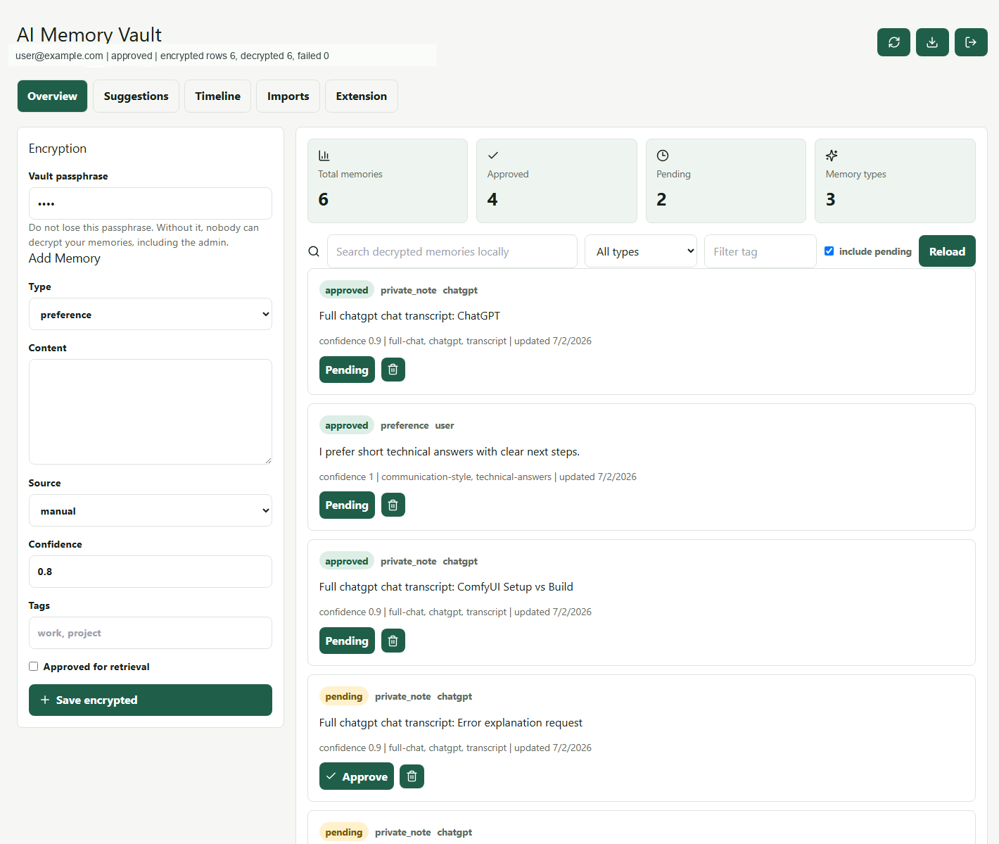
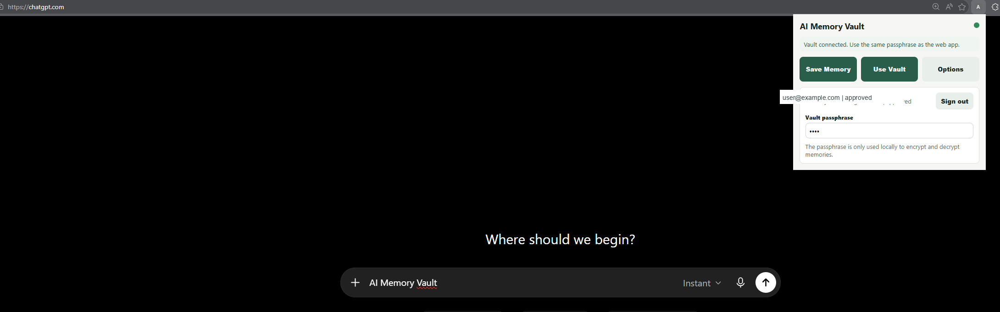

# AI Memory Vault

AI Memory Vault is a personal AI memory layer for saving and reusing context across AI tools. It supports a hosted Supabase mode with client-side encryption, plus a local FastAPI mode for self-hosted/private development.

Core idea: one memory, many AIs, owned by the user.

Product promise:

```text
ChatGPT has memory for ChatGPT.
AI Memory Vault gives you memory for every AI.
```

## Developer

AI Memory Vault is developed and maintained by **Rajendra Didel**.

The project is built as a privacy-first personal AI memory tool: users own their memory data, and hosted memory content is encrypted in the browser before it is stored.

## Why this is different from ChatGPT or Claude memory

Hosted assistant memory is usually tied to one vendor account and controlled by that vendor's product surface. AI Memory Vault keeps the source of truth on your machine, uses explicit approval before memories are returned by default, and exposes the same memory layer to any compatible client through HTTP or MCP.

In hosted mode, memory content is encrypted in the browser before it is stored. Supabase stores ciphertext, not readable memory text. The user's vault passphrase is never sent to Supabase.

## Hosted App

Current deployment:

[Live Demo](https://ai-memory-vault.com/)

Hosted stack:

- Frontend: React + Vite on Cloudflare Pages
- Auth and database: Supabase Auth + Postgres + Row Level Security
- Privacy: client-side AES-GCM encryption with a user vault passphrase
- Extension: browser extension signs in with the same Supabase account and uses the same passphrase

Production setup notes:

- Cloudflare Pages must serve the app over HTTPS because Web Crypto is required for encryption.
- New Supabase users can be self-service approved if `profiles.status` defaults to `approved`.
- Users who forget their vault passphrase cannot recover encrypted memory content.
- The extension package is built from `browser_extension/`. Public GitHub config is blank; fill `browser_extension/config.js` only when packaging your own official release.

See:

- [`docs/PRODUCTION_LAUNCH.md`](docs/PRODUCTION_LAUNCH.md)
- [`docs/SUPABASE_DEPLOYMENT.md`](docs/SUPABASE_DEPLOYMENT.md)
- [`docs/SUPABASE_EXTENSION.md`](docs/SUPABASE_EXTENSION.md)
- [`mcp_supabase_bridge/README.md`](mcp_supabase_bridge/README.md)

## Support Development

AI Memory Vault is free to use. If it helps you, support the project:

- [Star on GitHub](https://github.com/ai-encryption-tool/ai)
- [Buy me a coffee](https://ko-fi.com/aimemoryvault)
- [EUR5 Coffee](https://ko-fi.com/aimemoryvault)
- [EUR20 Sponsor](https://ko-fi.com/aimemoryvault)
- [EUR100 Company Sponsor](https://ko-fi.com/aimemoryvault)

## What is included

- Backend API: Python, FastAPI, SQLite, local Qdrant client, `sentence-transformers/all-MiniLM-L6-v2`
- Web dashboard: React, Vite, Tailwind
- MCP server: Python MCP SDK, connects to the backend API
- Ask Memory retrieval synthesis page
- Memory Suggestions extraction pipeline
- Timeline
- Import Center for ChatGPT/Claude ZIP, JSON, txt, and md
- Chrome browser extension
- Docker Compose deployment for backend, frontend, and MCP server
- Basic API tests for create, search, approve, delete, export, and import

## Product workflows

```text
ChatGPT / Claude / Cursor / Browser extension / Import Center
-> Memory suggestions
-> User approves
-> MCP/API search
-> Any AI can retrieve context
```

Dashboard pages:

- `/` Overview, CRUD, stats, filters, provenance, detail modal
- `/ask-memory` ask a question and see retrieved memories plus generated answer
- `/suggestions` paste or upload text/markdown and extract memory candidates
- `/timeline` chronological memory timeline
- `/imports` upload ChatGPT/Claude exports or vault JSON
- `/landing` product positioning page

## Local setup

```bash
cp .env.example .env
cd backend
python -m venv .venv
.venv\Scripts\activate
pip install -r requirements.txt
uvicorn app.main:app --reload
```

In another terminal:

```bash
cd frontend
npm install
npm run dev
```

Open `http://localhost:5173` and log in with `LOCAL_PASSWORD` from `.env`.

If port `8080` is blocked on Windows, use:

```powershell
cd frontend
$env:VITE_API_URL="http://localhost:8000"
npm.cmd run dev -- --host 127.0.0.1 --port 8081
```

## Docker setup

```bash
cp .env.example .env
docker compose up --build
```

- Dashboard: `http://localhost:5173`
- API: `http://localhost:8000`
- API docs: `http://localhost:8000/docs`

The first backend start can take time because the embedding model may be downloaded. Data is stored in the Docker volume `backend-data`.

## API examples

Set your key:

```bash
export API_KEY=dev-local-api-key-change-me
```

Health check:

```bash
curl http://localhost:8000/health
```

Create a pending memory:

```bash
curl -X POST http://localhost:8000/memories \
  -H "Content-Type: application/json" \
  -H "X-API-Key: $API_KEY" \
  -d '{"type":"preference","content":"I prefer concise technical summaries.","source":"api","confidence":0.9}'
```

Approve a memory:

```bash
curl -X POST http://localhost:8000/memories/MEMORY_ID/approval \
  -H "Content-Type: application/json" \
  -H "X-API-Key: $API_KEY" \
  -d '{"approved":true}'
```

Search approved memories:

```bash
curl "http://localhost:8000/memories/search?q=technical%20summaries" \
  -H "X-API-Key: $API_KEY"
```

Search including pending memories for debugging:

```bash
curl "http://localhost:8000/memories/search?q=technical%20summaries&include_pending=true" \
  -H "X-API-Key: $API_KEY"
```

Export:

```bash
curl http://localhost:8000/memories/export -H "X-API-Key: $API_KEY" > memories.json
```

Import:

```bash
curl -X POST http://localhost:8000/memories/import \
  -H "Content-Type: application/json" \
  -H "X-API-Key: $API_KEY" \
  --data-binary @memories.json
```

## MCP usage

For the hosted Supabase encrypted vault, use the local MCP bridge:

```text
mcp_supabase_bridge/
```

It lets Codex, Claude Desktop, Cursor, and other MCP clients search and create encrypted memories. Decryption happens locally on the user's computer. See [`mcp_supabase_bridge/README.md`](mcp_supabase_bridge/README.md).

### Local FastAPI MCP

The MCP server exposes:

- `search_memory(query: string, include_pending: boolean)`
- `create_memory(content: string, type: string, source: string)`
- `list_memories()`
- `update_memory(id: string, content?: string, type?: string, confidence?: number)`
- `delete_memory(id: string)`
- `approve_memory(id: string)`
- `reject_memory(id: string)`
- `ask_memory(query: string)`

Run locally:

```bash
cd mcp_server
python -m venv .venv
.venv\Scripts\activate
pip install -r requirements.txt
$env:BACKEND_URL="http://localhost:8000"
$env:API_KEY="dev-local-api-key-change-me"
python server.py
```

Example MCP client config:

```json
{
  "mcpServers": {
    "ai-memory-vault": {
      "command": "python",
      "args": ["C:/path/to/AI Memory Vault/mcp_server/server.py"],
      "env": {
        "BACKEND_URL": "http://localhost:8000",
        "API_KEY": "dev-local-api-key-change-me"
      }
    }
  }
}
```

Memories created through MCP are pending by default. Approve them in the dashboard before they are returned by normal search.

More MCP client setup examples are in [`docs/MCP_SETUP.md`](docs/MCP_SETUP.md).

## Browser extension

The browser extension is included in this repository in the `browser_extension/` folder.

Users can use it for free without waiting for a browser store release:

1. Open the GitHub repository.
2. Click **Code** -> **Download ZIP**.
3. Unzip the downloaded file.
4. Open `edge://extensions` or `chrome://extensions`.
5. Enable **Developer mode**.
6. Click **Load unpacked**.
7. Select the `browser_extension/` folder.
8. Open ChatGPT, Claude, Gemini, or Copilot.
9. Click the AI Memory Vault extension.
10. Sign in with the same account used in the web app.
11. Enter the same vault passphrase.

Local unpacked install for developers:

1. Open `chrome://extensions`.
2. Enable Developer mode.
3. Select Load unpacked.
4. Choose `browser_extension/`.
5. Open ChatGPT, Claude, Gemini, or Copilot.
6. Click the extension.
7. Use one of the core workflows:
   - Preview current chat -> Save full chat transcript
   - Preview current chat -> Generate memory suggestions -> Save pending or approved
   - Search Vault -> Select memories -> Insert context
   - Type a prompt -> Use Vault Context

In hosted mode, the extension uses the Supabase project configured in `browser_extension/config.js`. Users sign in with their account and enter their vault passphrase. They do not need a local backend URL or API key.

For this public repository, `browser_extension/config.js` is intentionally blank. Users can enter their own Supabase URL and publishable/anon key in extension Settings. For your official release package, fill `browser_extension/config.js` before creating the zip so users do not need to enter provider settings.

For public users, publish the packaged extension through Microsoft Edge Add-ons or the Chrome Web Store.

Until the extension is published in a browser store, the GitHub download + **Load unpacked** flow is the free installation path.

The extension does not scrape in the background and never auto-sends messages. It only captures or inserts text when the user clicks.

Extension trust model:

- Local backend only
- No data sent to external LLM APIs
- User previews before saving
- Extension-created memories are pending unless auto-approve is explicitly enabled
- Full chat transcripts can be saved as one memory when conversation continuity matters

Supported sites:

- `chatgpt.com`
- `claude.ai`
- `gemini.google.com`
- `copilot.microsoft.com`

Known selector limitations: AI vendors change their DOM often. The extension uses site-specific selectors plus fallbacks (`textarea`, `[contenteditable="true"]`, `[role="textbox"]`). If insertion fails, copy the generated context manually from the extension popup.

## Import Center

Open `/imports` and upload:

- ChatGPT export ZIP containing `conversations.json`
- Claude export ZIP/JSON
- AI Memory Vault JSON export
- `.txt` or `.md`

Imported memories are always pending and must be approved before normal retrieval.

## Screenshots

Dashboard with encrypted memories:



Browser extension inside ChatGPT:



Extension save and retrieval workflows:


## Testing

```bash
cd backend
pip install -r requirements-test.txt
pytest
```

Tests use a deterministic local hash embedding fallback so they do not need to download a model.

Frontend build:

```bash
cd frontend
npm install
npm run build
```

## Database migrations

Migration notes live in `backend/migrations/`. Phase 1-9 features reuse the current memory schema, so no destructive migration is required.

## Security notes

This MVP is local-first and does not send memories to external LLM APIs. The embedding model is loaded locally through `sentence-transformers`. Production deployments should add hashed passwords, rate limits, stronger session handling, encrypted storage, audit logs, per-client scoped API keys, backup encryption, and a real passkey/OIDC flow.

See [`docs/PRODUCTION_DEPLOYMENT.md`](docs/PRODUCTION_DEPLOYMENT.md).

## Future roadmap

- Browser extension and desktop tray capture flow
- Better deduplication and merge suggestions
- Per-tool access policies and scoped keys
- Encrypted-at-rest vault mode
- Memory provenance timeline
- Automatic but reviewable memory suggestions
- Richer MCP resources for project/person/goal contexts
- Optional local reranker for higher quality retrieval
