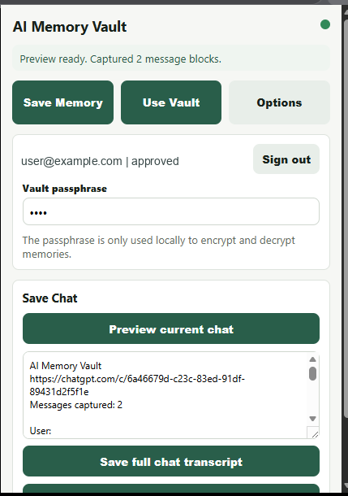
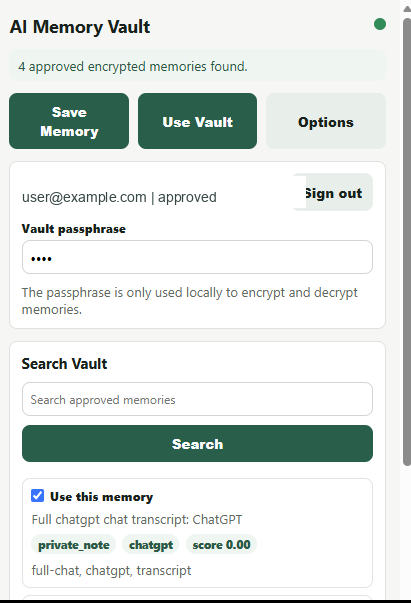

# Supabase Extension Setup

The extension now uses the same hosted Supabase vault as the web app. It no longer needs the local FastAPI backend URL or API key.

## 1. Install the Extension

The production extension is approved on the Chrome Web Store:

```text
https://chromewebstore.google.com/detail/mhnjllipemabeoenghgbanpckhnbddcm?utm_source=item-share-cb
```

Install it from Chrome Web Store for normal use.

Developer fallback:

1. Open `chrome://extensions` or `edge://extensions`.
2. Enable Developer mode.
3. Click **Load unpacked**.
4. Choose `browser_extension/`.

## 2. Supabase Configuration

Normal users do not need to enter a Supabase URL or anon key. The published extension already contains the production Supabase configuration.

For self-hosted development, edit `browser_extension/config.js` before packaging:

```text
Supabase URL: https://YOUR_PROJECT.supabase.co
Supabase anon key: YOUR_SUPABASE_ANON_KEY
```

## 3. Sign In

Create an account or sign in directly from the extension. The web dashboard is optional; the same email/password works in both places.

New users are approved automatically by the production database default. No manual approval is needed for normal signup.

If a user forgets their login password, they can enter their email in the extension and click **Forgot password?**. The reset link opens the web app so they can set a new password.

## 4. Enter Vault Passphrase

Use the same vault passphrase you use in the web app.

The passphrase never goes to Supabase. It is used locally by the extension to encrypt/decrypt memories.

## 5. Save Memory

1. Open ChatGPT, Claude, Gemini, Copilot, or another chat page.
2. Open the extension.
3. Click **Save Memory**.
4. Click **Preview current chat**.
5. Edit the **Chat name** if you want a clearer title.
6. Choose either:
   - **Save chat**
   - **Generate memory suggestions**, then save selected suggestions

If **Auto-approve new memories** is off, the saved memory is pending and will not be used by search until approved.

## 6. Saved Chats

1. Open the extension.
2. Click **Use Vault**.
3. Click **Show saved chats**.
4. Rename a chat or click **Use this chat**.
5. Short context is inserted directly into the active AI chat. Large context reveals the copy box so the user can copy and paste it.

## 7. Use Vault

1. Type a prompt in the AI chat box.
2. Open the extension.
3. Click **Use Vault**.
4. Click **Find relevant memory for current prompt**.
5. Select memories.
6. Click **Use Vault Context**.
7. Paste the copied context into the AI chat.

Search happens locally after encrypted memories are downloaded and decrypted in the extension.

## Screenshots




